# The Big Bank Deposit Box Pattern Helper

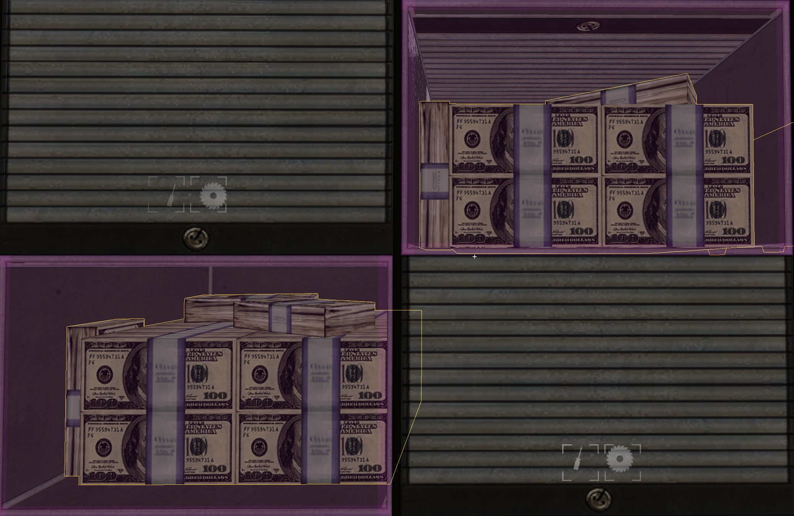

More images

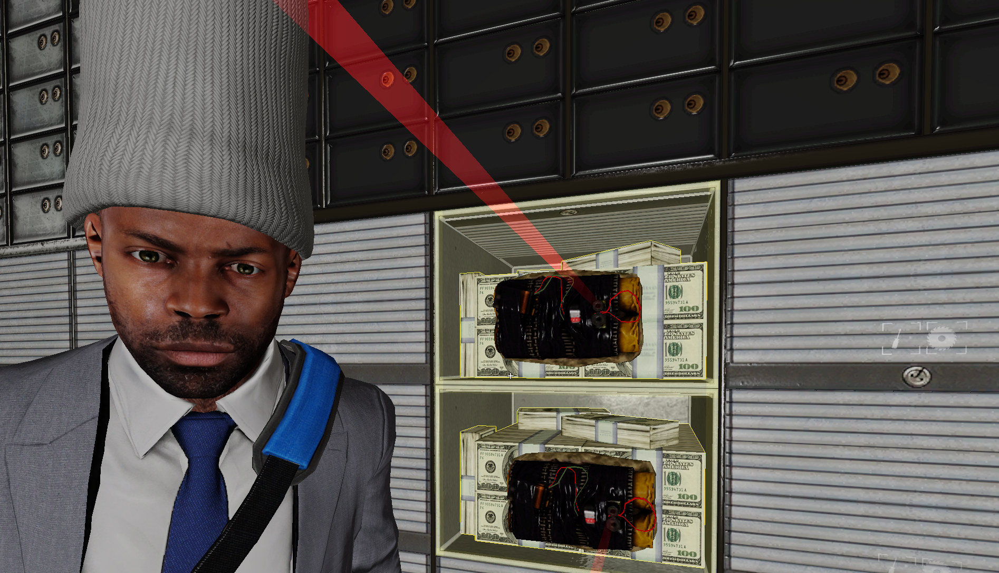
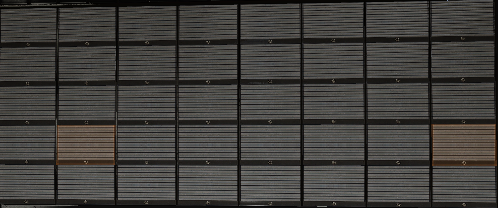
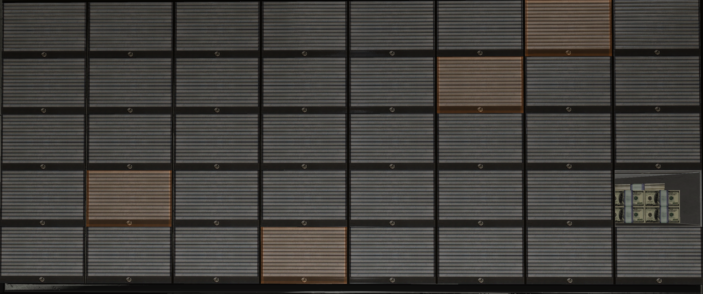
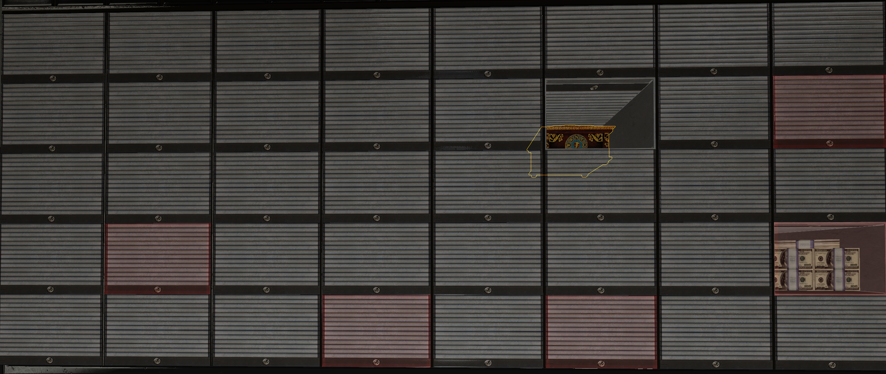
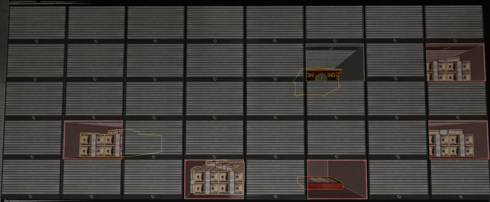
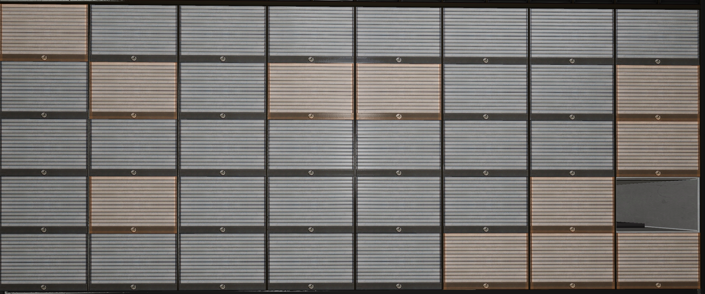
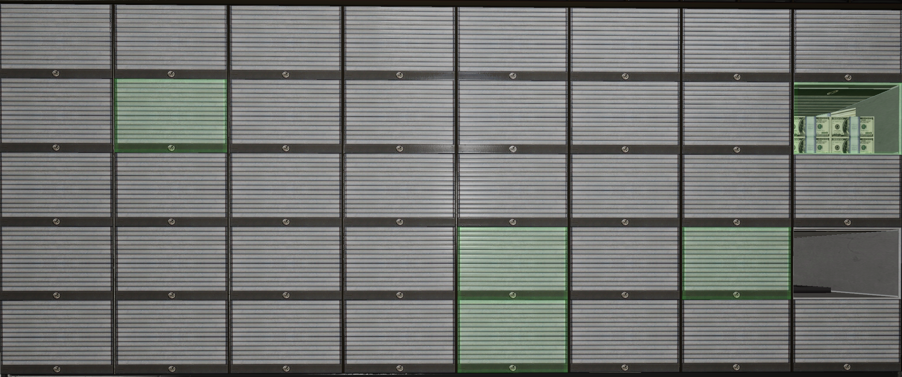
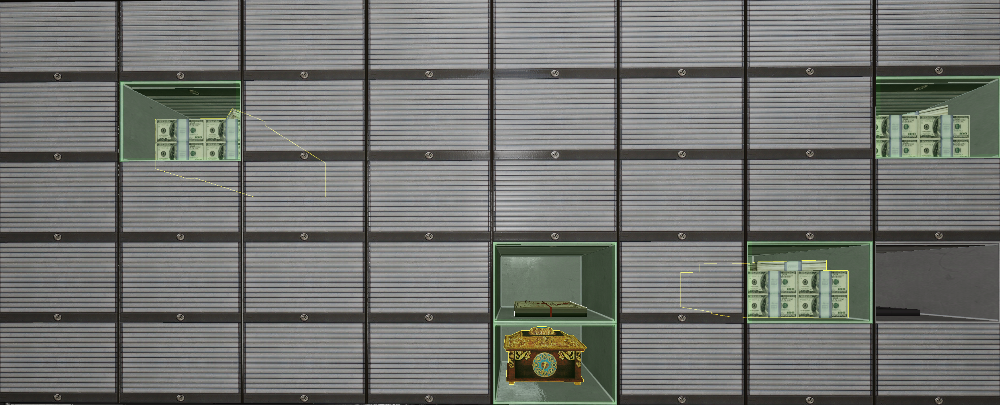
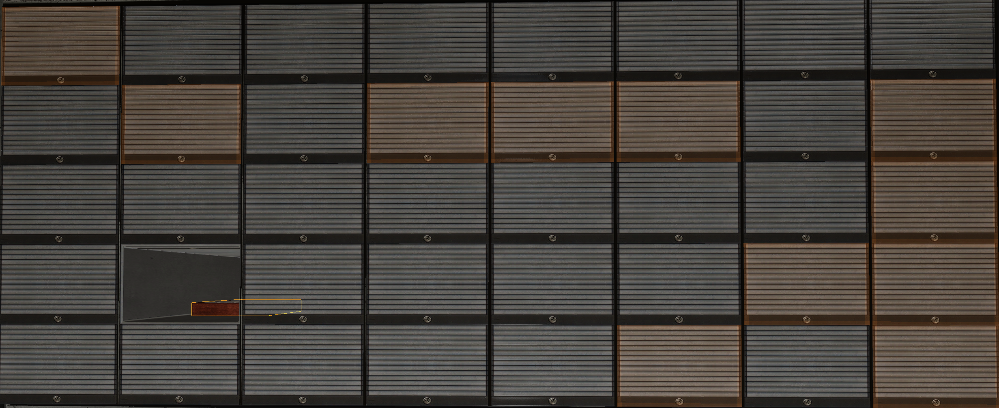
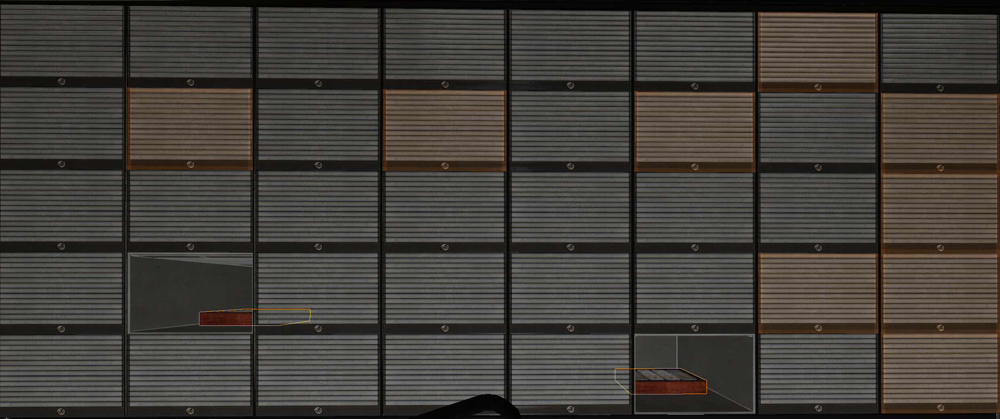
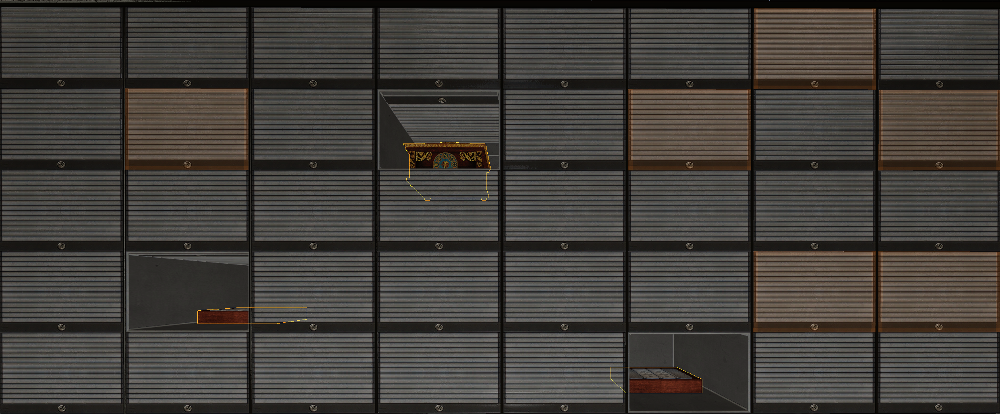
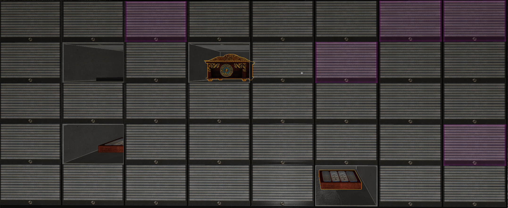
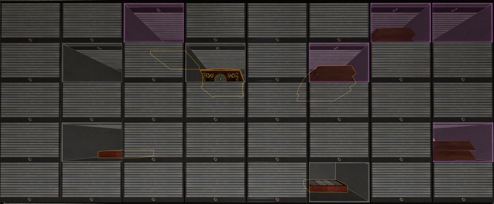
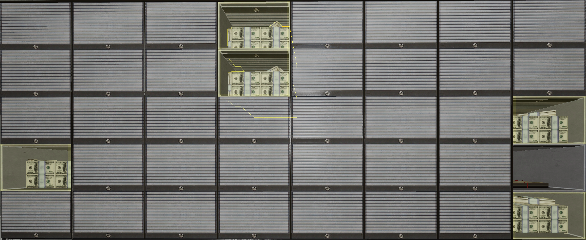
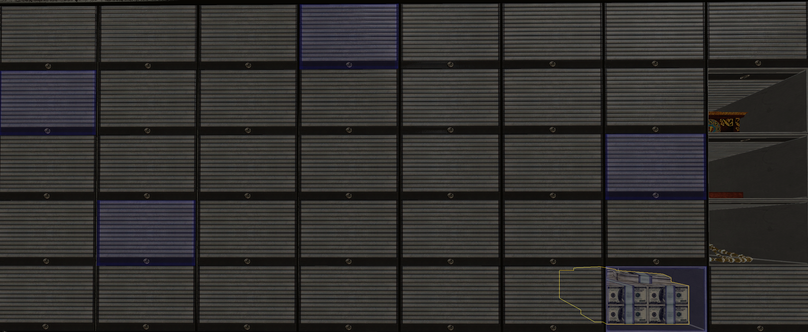
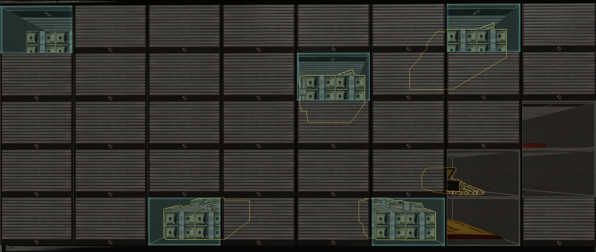

PAYDAY 2 SuperBLT mod that helps find loot in Big Bank deposit boxes.
It would be easy to create a mod that marks the exact loot boxes from the start, but that felt cheaty and boring. This mod guides players through finding them instead.

## How The Guide Works

Each Big Bank deposit box wall follows one of 6 possible layouts.

Initially, the mod marks boxes that are useful for figuring out the layout. Each opened box helps rule out parts of the possible layouts. After every result, the mod looks at the layouts that are still possible and marks the boxes that should narrow them down the most. When only one layout remains, the boxes for that layout are marked in the pattern color.

In the worst case, following the guide takes 4 opened boxes to identify the pattern.

## Colors

- Guide marker: orange
- Pattern 1: red
- Pattern 2: yellow
- Pattern 3: green
- Pattern 4: blue
- Pattern 5: cyan
- Pattern 6: magenta

## Install

1. Install SuperBLT.
2. Put this folder in `PAYDAY 2/mods/`.
3. Start the game.
4. Play `The Big Bank`; markers appear on detected deposit boxes.

## Credits

- [A complete guide to Big Bank's deposits and their RNG](https://steamcommunity.com/sharedfiles/filedetails/?id=2959914804) by Javgarag.
